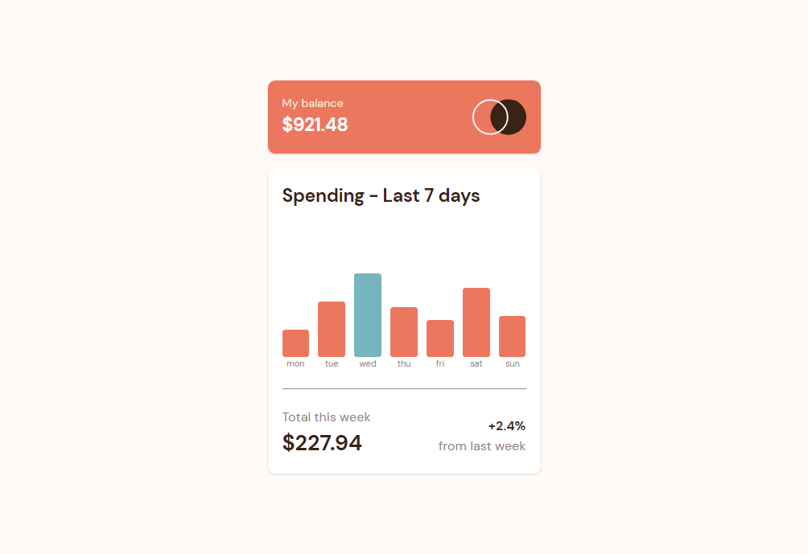

# Frontend Mentor - Expenses chart component solution

This is a solution to the [Expenses chart component challenge on Frontend Mentor](https://www.frontendmentor.io/challenges/expenses-chart-component-e7yJBUdjwt). Frontend Mentor challenges help you improve your coding skills by building realistic projects. 

## Table of contents

- [Overview](#overview)
  - [The challenge](#the-challenge)
  - [Screenshot](#screenshot)
  - [Links](#links)
- [My process](#my-process)
  - [Built with](#built-with)
  - [What I learned](#what-i-learned)
  - [Continued development](#continued-development)
  - [Useful resources](#useful-resources)
- [Author](#author)

## Overview

### The challenge

Users should be able to:

- View the bar chart and hover over the individual bars to see the correct amounts for each day
- See the current day’s bar highlighted in a different colour to the other bars
- View the optimal layout for the content depending on their device’s screen size
- See hover states for all interactive elements on the page
- **Bonus**: Use the JSON data file provided to dynamically size the bars on the chart

### Screenshot



### Links

- Solution URL: [https://www.frontendmentor.io/solutions/expenses-chart-component-solution-with-dynamic-graphics-HU-S1W3KX-]
- Live Site URL: [https://ozanweb.github.io/expenses-chart-component-main/]

## My process

### Built with

- Semantic HTML5 markup
- CSS Flexbox
- CSS combinators
- Mobile-first workflow
- JS
- Google Fonts

### What I learned

- It is easier to use CSS's drawing capabilities to create dynamic graphics with the help of JS. ```Canvas``` approarch would be hard way of doing so here.

- ```fetch()``` function together with ```async``` and ```await``` keys are used to retrieve data from an external file.

### Continued development

I have replaced the monthly spending with weekly spending to demonstrate addition property of JS.

### Useful resources

- [https://developer.mozilla.org/] - This is the place to learn how to use some JS function.
- [https://stackoverflow.com/] - Always a good place to find answers to specific questions.

## Author

- Frontend Mentor - [@ozanweb](https://www.frontendmentor.io/profile/ozanweb)
- LinkedIn - [@ozanpalanci](https://www.linkedin.com/in/ozanpalanci/)
